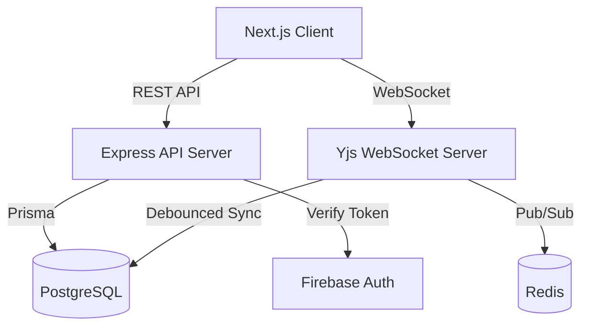

# Architecture Overview

## Tech Stack
- **Frontend:** Next.js (App Router), React, TypeScript, Tailwind CSS (assumed).
- **Backend:** Node.js, Express.js REST API, TypeScript.
- **WebSocket Server:** Yjs WebSocket implementation (y-websocket).
- **Database:** PostgreSQL with Prisma ORM.
- **Cache / PubSub:** Redis (for Yjs synchronization and rate-limiting).
- **Authentication:** Firebase Auth (Client) + Firebase Admin (Server).
- **Infrastructure:** Docker Compose (local dev).

## High-Level Topology

## Boundaries & Constraints
- **State Management:** Yjs handles real-time editor state. Express handles transactional business logic.
- **Data Persistence:** CRDT updates are kept in memory and synchronized via Redis. A debouncer persists the Y.Doc state to PostgreSQL periodically.
- **Secrets:** API keys, Firebase private keys, DB URLs must be in `.env` and never committed.
